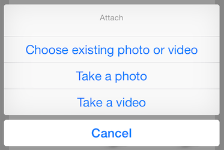

# MediaPickerController

Neat API for presenting the classical action sheet for picking an image or video from the device or camera.

------




## Overview

We know that presenting the famous action sheet for picking media is pretty common in most of iOS apps. However, achieving that functionality usually requires for you to write lots of boilerplate code, in which you're very likely to encounter awful things along the way (like  `kUTTypeImage` or `info[UIImagePickerControllerOriginalImage]`, just to mention).

`MediaPickerController` acts as a layer between your `UIViewController` instance and the iOS native APIs for handling media picking (provided by `AVFoundation` and `MobileCoreServices`).

By using this class, you won't ever have to worry about writing the aforementioned boilerplate code; this class handles all of that internally for you, providing a clean and elegant API that you can use in your `UIViewController`s with just a few lines of code.


## Features

- Two modes allowed: Take an image, or take an image or video.
- When picking an image, you get the `UIImage` object directly.
- When picking a video, you get the `NSData` representing the video, plus the `NSURL` where it's allocated in the device, and a `UIImage` object representing a thumbnail image preview of the video.
- Automatic detection of device capabilities: Action sheet options for taking media from camera are automatically disabled (not showed) if the device doesn't have one.


## Usage

You only have to worry about 4 simple things:

- Initializing a `MediaPickerController` object.
- Setting its `delegate` to be your `UIViewController` class.
- Calling the `show()` method whenever you want to pick media.
- Conforming to the `MediaPickerControllerDelegate` protocol and using the results within the methods it provides.


## Example

Here's the `ViewController` class that comes as an example with the project:

```swift
class ViewController: UIViewController {

    @IBOutlet weak var imageView: UIImageView!
    @IBOutlet weak var statusLabel: UILabel!

    var mediaPickerController: MediaPickerController!

    // MARK: - Lifecycle

    override func viewDidLoad() {
        super.viewDidLoad()
        self.mediaPickerController = MediaPickerController(type: .ImageAndVideo, presentingViewController: self)
        self.mediaPickerController.delegate = self
    }

    // MARK: - IBAction

    @IBAction func pickMedia(sender: UIBarButtonItem) {
        self.mediaPickerController.show()
    }

}

extension ViewController: MediaPickerControllerDelegate {

    func mediaPickerControllerDidPickImage(image: UIImage) {
        self.statusLabel.text = "Picked Image\nPreview:"
        self.imageView.image = image
    }

    func mediaPickerControllerDidPickVideoWithURL(url: NSURL, videoData: NSData, thumbnail: UIImage) {
        self.statusLabel.text = "Picked Video\nURL in device: \(url.absoluteString)\nThumbnail Preview:"
        self.imageView.image = thumbnail
    }

}
```


## Setup

You can just clone the repo and copy the `MediaPickerController` folder to your project, or install it through [cocoapods](http://cocoapods.org/) to keep it up to date.


## Contact Us

For **questions** or **general comments** regarding the use of this library, please use our public [hipchat room](http://inaka.net/hipchat).

If you find any **bugs** or have a **problem** while using this library, please [open an issue](https://github.com/inaka/IKFadeButton/issues/new) in this repo (or a pull request).

You can also check all of our open-source projects at [inaka.github.io](http://inaka.github.io/).